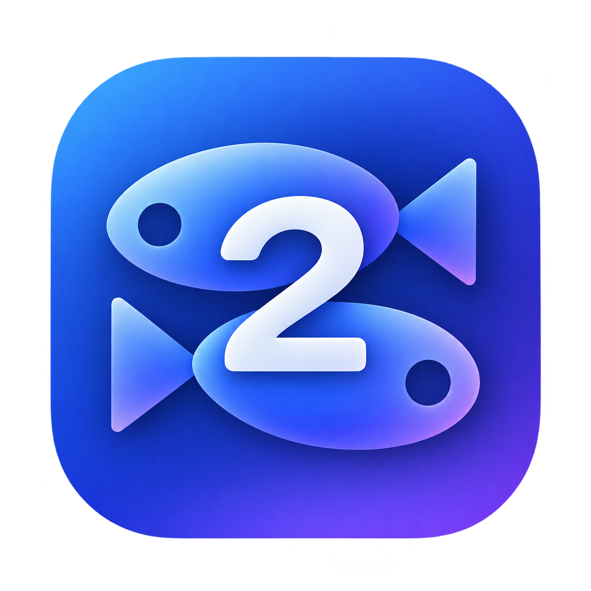

<p align="center">
  
</p>

<h1 align="center">krkr-rs</h1>

<p align="center">
  <b>基于 <a href="https://github.com/2468785842/krkr2">krkr2</a> 原版源码移植、
  用 Rust + Bevy 重写的 KiriKiri2（TVP）视觉小说引擎。</b>
</p>

<p align="center">
  <a href="README.md">English</a> · <b>简体中文</b>
</p>

---

**krkr-rs** 是一个使用 Rust 原生重写的 KiriKiri2 (TVP) 引擎，旨在 Linux 和 Android 平台上运行基于 KiriKiri2 开发的游戏。

通过将原有的 C++/OpenGL/Cocos2d-x 架构替换为 **Bevy** 和 **Vulkan**，它在保持引擎高度兼容性的同时，为 Linux 和 Android 带来了现代化的渲染支持。

* **原生 TJS2 虚拟机：** 直接保留上游 C++ TJS2 虚拟机并通过 Rust FFI 进行调用，确保未经修改的游戏脚本和存档能够无缝运行。
* **Rust 核心实现：** 原生重写了归档解包、TLG5/TLG6 图像解码、自定义混合模式、字体栅格化、Ogg/Opus 音频处理以及 KAG 剧本标签解析。
* **视频播放：** Linux 桌面端使用 FFmpeg，Android 端则接入原生 `MediaCodec`。
* **Android 前端：** 包含一个基于 Kotlin / Material 3 的原生启动器，支持系统文件选择器，针对 `arm64-v8a` 架构构建。

**快速开始**

```bash
# 编译项目
cargo build

# 运行游戏
./target/debug/krkr-rs run "/path/to/game"

# 无头模式（Headless）冒烟测试
./target/debug/krkr-rs run "/path/to/game" --headless

```

**文档与开源许可**

* **`docs/`** — 涵盖渲染、字体、Android NDK 构建（`docs/android.md`）及 API 对齐校验（`docs/native_parity.md`）的设计文档。
* **开源许可：** GPL-3.0（嵌入的 TJS2 VM 保持其上游 BSD 风格许可）。

---

> **又及：** 目前完全没有支持 macOS 和 iOS 的计划，单纯是因为我手头既没有 Mac 也没有 iPhone，没办法进行开发和测试。（对苹果用户们说声抱歉了！）
